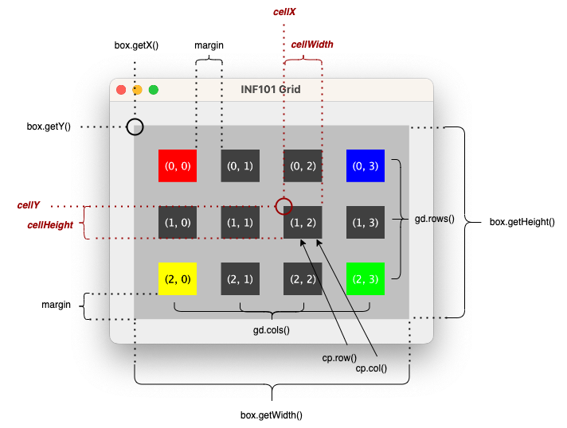

# Rutenett


I denne lab'en skal vi tegne et rutenett som vist over. Oppgaven består i hovedsak av tre deler:
1. Skriv en klasse `ColorGrid` som representerer et rutenett av farger.
2. Skriv en klasse `CellPositionToPixelConverter` som har en metode som regner ut piksel-koordinatene for en gitt rute.
2. Skriv en klasse `GridView` som kan tegne et rutenett av farger.

* [Anbefalte forberedelser](#anbefalte-forberedelser)
* [Bli kjent med utlevert kode](#bli-kjent-med-utlevert-kode)
* [Opprett rutenett av farger](#opprett-rutenett-av-farger)
* [Tegning](#tegning)
* [Opprett rutetnettet som skal tegnes](#opprett-rutenettet-som-skal-tegnes)
* [CellPositionToPixelConverter](#cellpositiontopixelconverter)
* [drawGrid](#drawgrid)
* [drawCell](#drawcell)

## Anbefalte forberedelser

* Laben antar at du har kjennskap til grunnleggende java, inkludert [grensesnitt](https://inf101.ii.uib.no/notat/grensesnitt/), [klasser og objekter](https://inf101.ii.uib.no/notat/objekter/).
* Du bør ha skummet igjennom kursnotatene om [arv](https://inf101.ii.uib.no/notat/arv), men vi kommer ikke til å gå i dypden på dette i denne lab'en.
* Kursnotatene om [grafikk](https://inf101.ii.uib.no/notat/grafikk) vil være spesielt relevante. Kan brukes som et oppslagsverk for å finne ut hvordan noe kan tegnes.

## Bli kjent med utlevert kode

Undersøk filene i pakken `no.uib.inf101.colorgrid`, og besvar spørsmålene i `TextQuestions` ([link](./src/main/java/no/uib/inf101/colorgrid/TextQuestions.java)).

✅ Du er klar til gå videre når alle testene i `TestTextQuestions` ([link](./src/test/java/no/uib/inf101/colorgrid/TestTextQuestions.java)) passerer.

## Opprett rutenett av farger

I denne oppgaven skal du lage klassen `ColorGrid` ([link](./src/main/java/no/uib/inf101/colorgrid/ColorGrid.java)). Den er nå helt tom.

* [ ] La klassen implementere grensesnittet `IColorGrid`
* [ ] La klassen ha en konstruktør med to parametre: en int som beskriver antall rader, og en int som beskriver antall kolonner. Standard-verdien til en posisjon i rutenettet (før `set`-metoden har blitt kalt på gitt posisjon) skal være `null`.
* [ ] Fyll ut metodene du trenger i overenstemmelse med javadoc-kommentarene til `IColorGrid`.

Du kan leke deg litt i `Main::main` for å sjekke for deg selv at klassen fungerer som du forventer. For eksempel:

```java
// Opprett et rutenett med 3 rader og 4 kolonner
IColorGrid grid = new ColorGrid(3, 4);
System.out.println(grid.rows()); // forventer 3
System.out.println(grid.cols()); // forventer 4

// Sjekk at standard-verdien er null      
System.out.println(grid.get(new CellPosition(1, 2))); // forventer null

// Sjekk at vi kan endre verdien på en gitt posisjon        
grid.set(new CellPosition(1, 2), Color.RED);
System.out.println(grid.get(new CellPosition(1, 2))); // forventer rød
System.out.println(grid.get(new CellPosition(2, 1))); // forventer null
```
Husk å rydde opp etter deg i `Main::main` når du er ferdig!

✅ Du er klar til gå videre når alle testene i `TestColorGrid` ([link](./src/test/java/no/uib/inf101/colorgrid/TestColorGrid.java)) passerer.

.

## Tegning

Ha kursnotatene om [grafikk](https://inf101.ii.uib.no/notat/grafikk) i bakhodet når du gjør denne oppgaven.

I `GridView`:
* [ ] La klassen utvide `JPanel`
* [ ] La konstruktøren til `GridView` sette standard størrelse på lerretet til 400x300 piksler
* [ ] Overskriv metoden `public void paintComponent(Graphics g)`. Begynn med å kalle på super-metoden og opprett en Graphics2D -variabel fra g, slik som vist i kursnotatene om grafikk.
* [ ] Velg din favoritt-figur fra kursnotatene og tegn den i paintComponent (midlertidig, fjern den igjen når vi senere skal tegne rutenettet )

I `Main`:
* [ ] Opprett et `GridView` -objekt
* [ ] Opprett et `JFrame` -objekt
* [ ] Kall `setContentPane` -metoden på JFrame-objektet med GridView-objektet som argument
* [ ] Kall `setTitle`, `setDefaultCloseOperation`, `pack` og `setVisible` på JFrame-objektet etter mønster fra kursnotatene om grafikk.

✅ Du er klar til å gå videre hvis du ser tegningen din i et vindu når du kjører `Main`.

## Opprett rutenettet som skal tegnes

I `Main::main` skal vi nå opprette et rutenett, og gi det til `GridView`-konstruktøren som et argument ved opprettelse. Deretter skal vi endre GridView slik at den tegner dette rutenettet.

* [ ] I `Main::main`, opprett et ColorGrid-objekt med 3 rader og 4 kolonner. Sett fargene i hjørnene til å være
  * Rød i hjørnet oppe til venstre (posisjon (0, 0))
  * Blå i hjørnet oppe til høyre (posisjon (0, 3))
  * Gul i hjørnet nede til venstre (posisjon (2, 0))
  * Grønn i hjørnet nede til høyre (posisjon (2, 3))
* [ ] I `GridView`, legg til en parameter av typen `IColorGrid` i konstruktøren, og legg også til en instansvariabel av samme type. Initialiser feltvariabelen med argumentet gitt til konstruktøren.

For å tegne rutenettet gjenstår det å endre på *paintComponent* -metoden. Vi skal benytte oss av tre hjelpemetoder for å tegne rutenettet. I *paintComponent* gjør vi et kall til

* `drawGrid`, som har som ansvar å tegne et fullstendig rutenett, inkludert alle rammer og ruter (alt innenfor det grå området i illustrasjonen). For å tegne selve rutene, kaller denne metoden på
* `drawCells`, som har som ansvar å tegne en samling av ruter. For hver rute regner denne metode ut hvor ruten skal være ved å kalle på hjelpemetoden
* `getBoundsForCell` som vet hvordan å regne ut posisjonen til én rute i rutenettet.

Det viser seg at det er den sistnevnte metoden som er mest komplisert. Vi kunne hatt `getBoundForCell` som en vanlig hjelpemetode, men siden dette er en relativt isolert operasjon som vi ønsker å kunne teste separat, oppretter vi en en klasse for denne hjelpemetoden: *CellPositionToPixelConverter*.

> Måten vi tenker på når vi skal utvikle et program er «top-down» -- man begynner med å dele opp oppgaven i store steg, og så drømmer vi opp hjelpemetoder vi trenger før disse hjelpemetodene faktisk eksisterer. Når vi faktisk koder, er det ofte lettest å gjøre det «bottom up», slik at vi kan teste hver enkelt byggeklosse/metode mens vi holder på. Dette for å si: hvilken rekkefølge du løser resten av oppgaven er opp til deg. Det kan være at det er lettere å hoppe litt frem og tilbake mellom de neste avsnittene.


## CellPositionToPixelConverter

Vi ønsker å opprette en hjelpemetode `getBoundsForCell` som oversetter koordinater i rutenettet til et rektangel med posisjon og størrelse beskrevet som piksler til bruk på et lerret. Det er naturlig at denne metoden
* har en parameter av typen `CellPosition` og 
* returnerer et `Rectangle2D` -objekt.

Men -- dette er ikke tilstrekkelig informasjon for å gjøre utregningen; vi trenger i tillegg å vite
* innefor hvilket område rutenettet befinner seg
* hvor mange rader og kolonner det er i rutenettet som helhet, og
* hvor stor avstanden mellom rutene skal være.

Disse siste delene med informasjon vil ikke endre seg særlig fra kall til kall, men er en del av *konteksten* metoden kjører i. Slik kontekst er best beskrevet som feltvariabler.

I klassen `CellPositionToPixelConverter`:

* [ ] Opprett feltvariabler:
  * Et `Rectangle2D` -objekt `box` som beskriver innenfor hvilket område rutenettet skal tegnes
  * Et `GridDimension` -objekt `gd` som beskriver størrelsen til rutenettet rutene vil være en del av
  * En `double` kalt `margin` som beskriver hvor stor avstanden skal være mellom rutene
* [ ] Opprett en konstruktør i klassen med tre parametre: et `Rectangle2D` -objekt, et `GridDimension` -objekt og en `double`. Initaliser feltvariablene med verdiene mottat i konstruktøren.
* [ ] Opprett metoden `getBoundsForCell` med en parameter av typen `CellPosition` (i figur under navgitt `cp`) og returtype `Rectangle2D`.

Returverdien er et `Rectangle2D` -objekt. For å opprette dette objektet, må du regne ut fire verdier: x, y, bredde og høyde for den gitte ruten. Så kan du returnere et nytt `Rectangle2D.Double` -objekt med disse verdiene.

Illustrasjonen under visualiserer parameterne og resultatvariablene. Svarte variabler er gitt som input eller er tilgjengelig som feltvariabler, mens de røde variablene er de du skal regne ut og returnere.



Hint:
* Benytt `double` hvis du gjør regnestykker som involverer divisjon, da unngår du avrundingsfeil.
* Ikke bland horisontale og vertikale verdier. Horsiontale begreper: x, bredde, kolonne. Vertikale begreper: y, høyde, rad.
* Begynn med å regne ut *cellWidth* og *cellHeight*, og bruk verdiene du finner der for videre kalkulasjoner.

> Eksempel: anta at du får følgende parametre (som i illustrasjonen):
>  * `box.getX()` er 30 og `box.getY()` er 30
>  * `box.getWidth()` er 340 og `box.getHeight()` er 240
>  * `cellPosition.col()` er 2 og `cellPosition.row()` er 1
>  * `gd.cols()` er 4 og `gd.rows()` er 3
>  * `margin` er 30
>
> Vi begynner med å regne ut `cellWidth`. Siden vi har 4 kolonner totalt, vil det gå med 5*30=150 piksler til marginer, og vi får da 190 piksler igjen å fordele på de fire kolonnene. Vi får da at cellen skal ha bredde 47.5.
>
> For å finne verdien til `cellX` begynner vi på `box.getX()` og legger til margin + rutebredde + margin + rutebredde + margin. Verdien blir da 30+30+47.5+30+47.5+30 = 215.
>
> Tilsvarende finner vi at `cellHeight` blir 40 og `cellY` blir 130.


✅ Du er klar til å gå videre når testene i `TestCellPositionToPixelConverter` passerer.

## drawGrid

Denne metoden i `GridView` skal ha et `Graphics2D` -objekt som parameter, og ikke ha noen returverdi. Planen er å først tegne en stor grå firkant, og så tegne selve rutene «oppå».

- [ ] Opprett et Rectangle2D -objekt med en fast 30 pikslers avstand til kanten på vinduet (se avsnitt om fast avstand til kantene på lerretet i kursnotater om [grafikk](https://inf101.ii.uib.no/notat/grafikk/#fast-avstand-til-kantene-på-lerretet))
  *  Det kan være lurt å lagre tallet som en konstant med et beskrivende navn (altså opprett en static final feltvariabel `private static final double OUTERMARGIN = 30;` og så bruke `OUTERMARGIN` i stedet for 30 når du kommer tilbake her)
- [ ] Fyll rektangelet med gråfarge på lerretet.
  * Det kan være lurt å lagre fargen som en konstant med et beskrivende navn (altså opprett en static final feltvariabel `private static final Color MARGINCOLOR = Color.LIGHT_GRAY;` og så bruke `MARGINCOLOR` i stedet for Color.LIGHT_GRAY når du kommer tilbake her)
- [ ] Opprett et `CellPositionToPixelConverter` -objekt.
  * Hvilket objekt med typen GridDimension skal du bruke som argument ved opprettelsen? Har du et slik objekt liggende et sted allerede?
  * Marginen skal være et fast tall; i eksempelillustrasjonen er tallet 30 blitt brukt. Det kan være lurt å lagre tallet som en konstant med et beskrivende navn.
- [ ] Gjør et kall til en hjelpemetoden `drawCells` beskrevet under

PS: Siden metoden benytter instansmetoder kan metoden *ikke* være static. Siden metoden ikke skal benyttes av noen utenfor `GridView` -klassen, bør metoden være *private*.

## drawCell

Denne metoden i `GridView` er uten returverdi, men skal ha tre parametre:
* et `Graphics2D` -objekt, lerretet rutene skal tegnes på
* et `CellColorCollection` -objekt, rutene som skal tegnes
* et `CellPositionToPixelConverter` -objekt som kan regne ut rutene sin posisjon

La metoden iterere gjennom rutene i CellColorCollection -objektet, og tegne hver av dem på lerretet. Dersom fargen er null, bruk `Color.DARK_GRAY` i stedet.

PS: siden drawCells ikke er avhengig av instansvariabler, bør metoden være *static*. Siden den ikke benyttes utenfor `GridCell` -klassen bør metoden være *private*.

✅ Du er ferdig med lab'en når testene i `TestGridView` passerer, og du kan kjøre Main-metoden og ser samme bilde som vist i illustrasjonen nå programmet kjører. Det skal fungere å endre størrelse på vinduet, og rutenettet skal strekke seg for å fylle hele lerretet med en fast avstand til kanten.